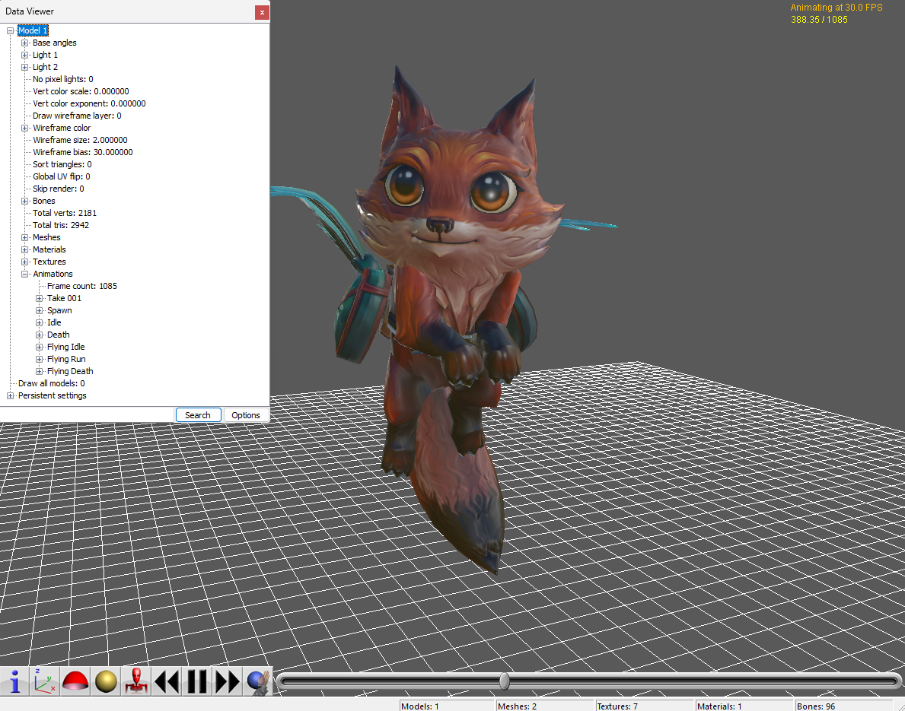

# mviewer

Rust-native exporter for Marmoset `.mview` scenes.

Author: Majid Siddiqui (<me@majidarif.com>)



## Download

Prebuilt binaries are published from GitHub Actions releases:

- Windows x64
- Linux x64
- macOS arm64
- macOS x64

Latest release: [`latest`](https://github.com/majimboo/mviewer/releases/latest)

Download the archive that matches your platform:

- Windows 64-bit: `mviewer-vX.Y.Z-windows-x64.zip`
- Linux 64-bit: `mviewer-vX.Y.Z-linux-x64.tar.gz`
- macOS Apple Silicon: `mviewer-vX.Y.Z-macos-arm64.tar.gz`
- macOS Intel: `mviewer-vX.Y.Z-macos-x64.tar.gz`

After extracting a release archive, run:

```text
mviewer --help
```

Desktop GUI:

```text
mviewer-gui
```

## Feature Parity

### Marmoset `.mview` / JS Parity

- [x] `.mview` archive parsing
- [x] `scene.json` parsing
- [x] static glTF scene export
- [x] animated glTF scene export
- [x] skinning export
- [x] camera export
- [x] light export
- [x] primary UV export
- [x] corrected UV orientation parity
- [x] packed normal decoding
- [x] vertex color export
- [x] material texture extraction
- [x] alpha texture merge
- [x] metallic-roughness texture packing
- [x] generated browser viewer for runtime sidecar playback
- [ ] full plain-glTF parity for all Marmoset-only runtime behavior
- [ ] `.glb` output
- [ ] direct `FBX` export
- [ ] direct `OBJ` export

### Project Features

- [x] Rust-native command-line tool
- [x] Native desktop GUI for file loading, scene inspection, mesh selection, and export
- [x] Windows, Linux, and macOS builds
- [x] GitHub Actions CI and release packaging
- [x] GitHub Pages project site
- [x] sample animated fixtures in-repo

## Quick Start

```powershell
mviewer input.mview output_dir
```

Example:

```powershell
mviewer test_data\vivfox.mview test_output\vivfox
```

This writes:

- `<name>.gltf`
- `<name>.bin`
- `viewer.html`
- `mviewer.runtime.json`
- copied texture files used by the scene
- merged `*_rgba.png` textures when the source scene uses a separate alpha map
- `mviewer_raw/` with all source archive entries

## GUI Workflow

Launch the desktop app with:

```text
mviewer-gui
```

The current GUI supports:

- opening a `.mview` file
- viewing scene metadata and counts
- inspecting meshes, materials, and animations
- choosing which meshes to export
- exporting the selected subset to glTF

## Output Formats

mviewer exports `.mview` scenes to glTF directly.

If you need other formats:

- `mview to fbx`: export to glTF first, then convert with Blender or another downstream tool
- `mview to obj`: export to glTF first, then convert if you only need static geometry/materials
- `mview to blender`: import the generated glTF into Blender

glTF is the primary interchange format because it preserves modern materials, skins, animation, cameras, and lights better than the old script-based workflow.

## Build From Source

Requirements:

- Rust stable toolchain

Build:

```powershell
cargo build --release
```

Run:

```powershell
cargo run --release -- <input.mview> [output_dir]
```

## Runtime Playback

After export, open `viewer.html` from the output directory in a browser. It loads the generated glTF, reads `mviewer.runtime.json`, and applies preserved runtime state such as:

- evaluated object transforms
- inherited visibility
- sampled light and camera properties
- sampled material UV and emissive properties
- preserved fog / sky / shadow-floor scene data

## Workflow Notes

mviewer is a Rust-native Marmoset `.mview` viewer, exporter, and converter focused on `.mview` to glTF export.

If you are looking for an `mview viewer`, `mview editor`, `mview to gltf`, `mview to fbx`, or `mview to obj` workflow, the current project path is:

`.mview` -> `glTF` -> optional conversion to `FBX`, `OBJ`, Blender, or other formats

This repository no longer uses the old Python extractors or the Noesis plugin as its primary workflow. The current implementation reads `.mview` archives directly, reconstructs the scene, exports glTF, and emits a runtime playback page for preserved Marmoset-specific behavior.

## Current Limitations

- stock third-party glTF viewers only see the standard glTF export
- full behavior parity depends on the generated runtime player plus `mviewer.runtime.json`, not plain glTF semantics alone
- direct `.glb`, `FBX`, and `OBJ` export are not implemented yet

## Reverse Engineering References

These files are still kept in the repo as format references:

- `docs/reverse-engineering/marmoset-d3f745560e47d383adc4f6a322092030.js`

The newer bundled Marmoset JavaScript is the primary reference for format and runtime parity work.
